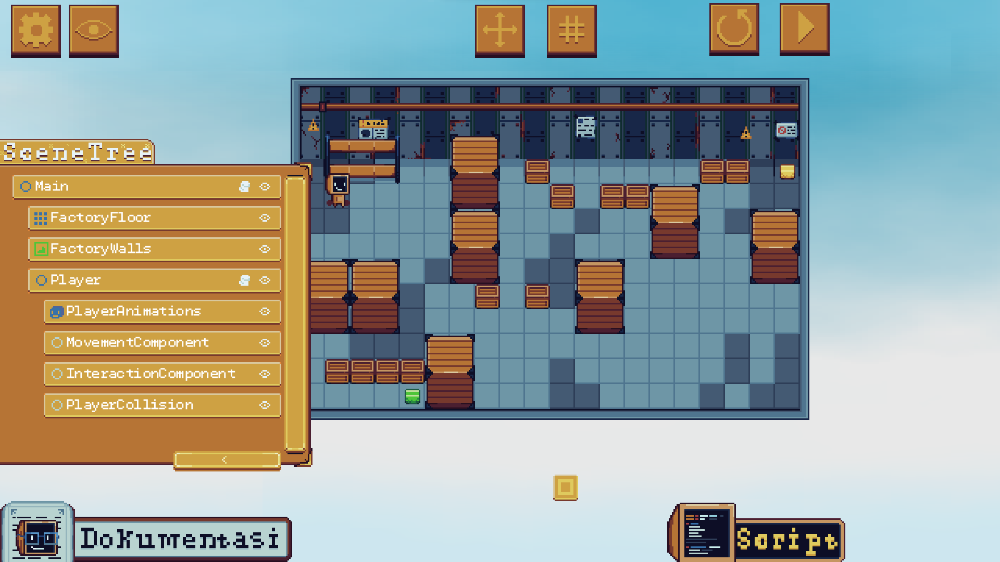
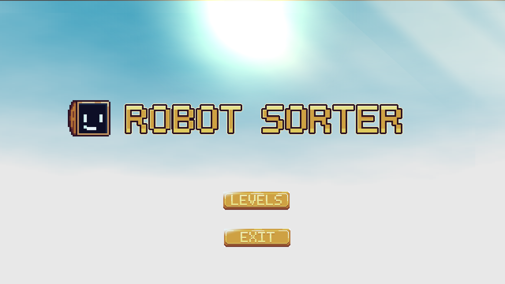

<div align="center">

# Robot Sorter

**A puzzle-based educational game where you control a robot using real code.**

*Game edukasi berbasis puzzle di mana kamu mengendalikan robot menggunakan kode nyata.*

[](LICENSE)
[](https://godotengine.org)
[]()
[]()

</div>

---

## 🇬🇧 English

### About
Robot Sorter is an educational puzzle game that teaches players logical thinking and the basics of programming. You control **SOR-BOT**, a sorting robot inside a factory, by writing code directly in the in-game script editor — no directional buttons, no joystick, just code.

### Features
- **In-Game Code Editor** — Write commands like `move_up()`, `grab()`, and `drop()` inside a real editor within the game
- **Custom Code Parser** — A hand-built parser that reads your code line by line, detects syntax errors, and executes commands sequentially
- **Mission & Objective System** — Each level has layered missions with real-time progress tracking
- **Star Rating System** — Earn 1–3 stars based on how efficient your code is
- **Scene Tree Inspector** — A Godot-inspired panel that lets you inspect the game's node structure
- **Box & Shelf Mechanics** — Grab and drop colored boxes onto matching shelves
- **7 Levels** — From beginner to challenging

### How to Play
1. Open the **Script Editor** by tapping the Script button
2. Analyze the level — find the boxes and their matching shelves
3. Open **Documentation** to find the commands you need
4. Write your commands inside `func run():`
5. Press **▶ Play** to execute your code
6. If the mission isn't complete, **Reset** and improve your code
7. Aim for 3 stars by using the fewest commands possible

### Installation

**Android**
1. Download `RobotSorter.apk`
2. Enable *Install from unknown sources* in your phone settings
3. Open the APK and follow the installation steps

**Windows**
1. Download `RobotSorter.exe`
2. Double-click to run — no installation needed

**Linux**
```bash
chmod +x RobotSorter.x86_64
./RobotSorter.x86_64
```

### Tech Stack
| Tool | Purpose |
|------|---------|
| Godot 4.6.1 | Game Engine |
| GDScript | Programming Language |
| Aseprite | Pixel Art & Animation |

### Screenshots



---

## 🇮🇩 Indonesia

### Tentang
Robot Sorter adalah game edukasi berbasis puzzle yang melatih pemain berpikir logis dan mengenal dasar-dasar pemrograman. Kamu mengendalikan **SOR-BOT**, robot penyortir di dalam sebuah pabrik, dengan cara menulis kode langsung di editor yang ada di dalam game — tidak ada tombol arah, tidak ada joystick, hanya kode.

### Fitur
- **In-Game Code Editor** — Tulis perintah seperti `move_up()`, `grab()`, dan `drop()` di dalam editor kode yang ada di dalam game
- **Custom Code Parser** — Parser buatan sendiri yang membaca kode baris per baris, mendeteksi error sintaks, dan mengeksekusi perintah secara sekuensial
- **Sistem Misi & Objektif** — Setiap level memiliki misi bertingkat dengan pelacakan progres secara real-time
- **Sistem Bintang** — Dapatkan 1–3 bintang berdasarkan seberapa efisien kode kamu
- **Scene Tree Inspector** — Panel terinspirasi dari Godot yang memungkinkan kamu melihat struktur node game
- **Mekanik Box & Shelf** — Ambil dan letakkan kotak berwarna ke rak yang sesuai
- **7 Level** — Dari mudah hingga menantang

### Cara Bermain
1. Buka **Script Editor** dengan menekan tombol Script
2. Analisa level — temukan kotak dan rak yang sesuai
3. Buka **Dokumentasi** untuk mencari perintah yang dibutuhkan
4. Tulis perintah di dalam `func run():`
5. Tekan **▶ Play** untuk menjalankan kode
6. Jika misi belum selesai, tekan **Reset** dan perbaiki kode
7. Usahakan 3 bintang dengan menggunakan perintah sesedikit mungkin

### Instalasi

**Android**
1. Download `RobotSorter.apk`
2. Aktifkan *Install dari sumber tidak dikenal* di pengaturan HP
3. Buka file APK dan ikuti instruksi instalasi

**Windows**
1. Download `RobotSorter.exe`
2. Klik dua kali untuk langsung menjalankan — tidak perlu instalasi

**Linux**
```bash
chmod +x RobotSorter.x86_64
./RobotSorter.x86_64
```

### Teknologi
| Tool | Kegunaan |
|------|---------|
| Godot 4.6.1 | Game Engine |
| GDScript | Bahasa Pemrograman |
| Aseprite | Pixel Art & Animasi |

### Screenshot


---

## License / Lisensi

Copyright (c) 2026 Zaidan (Tim Draedon) — All Rights Reserved.

See [LICENSE](LICENSE) for full details.

---

<div align="center">

Made  by **Tim Draedon** — Semarang, Indonesia, 2026

</div>
